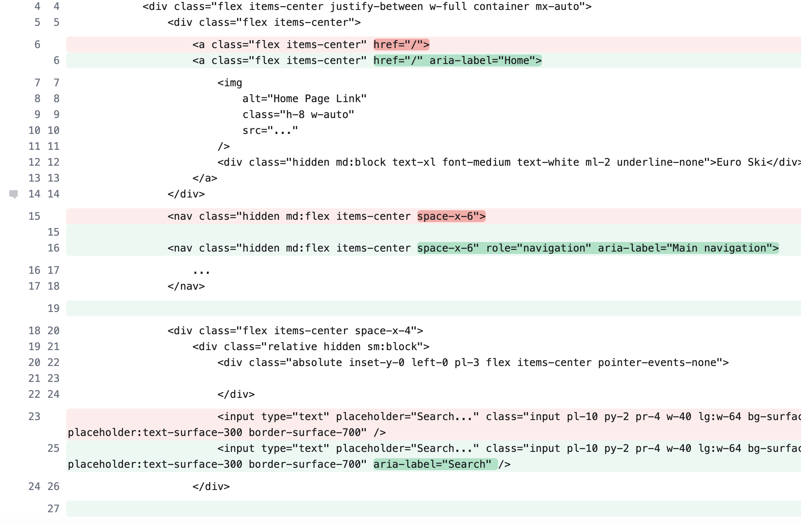
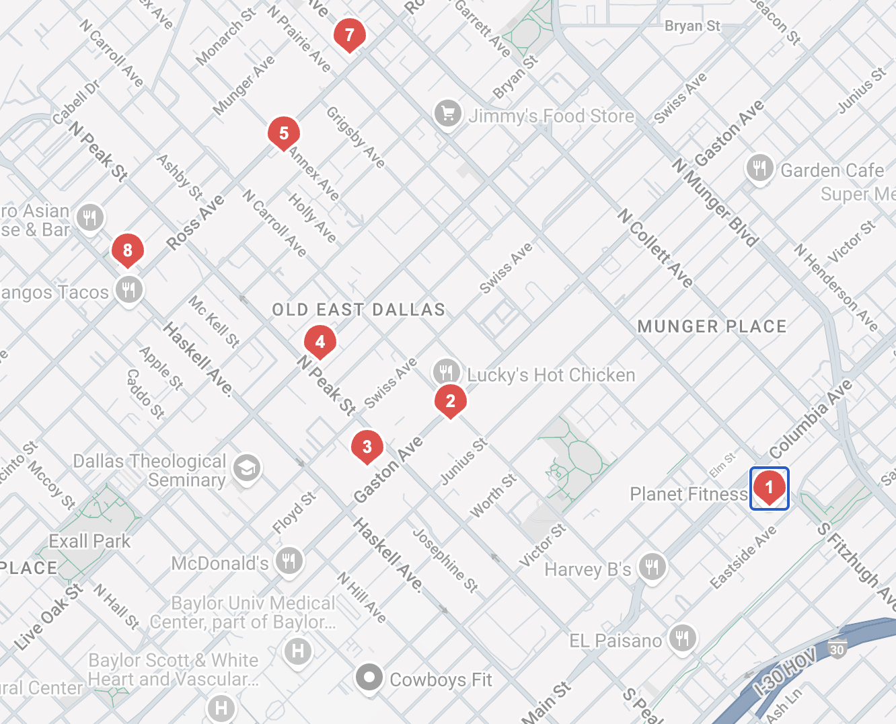
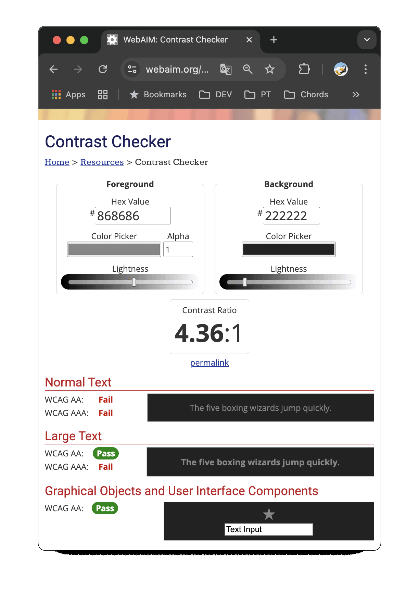
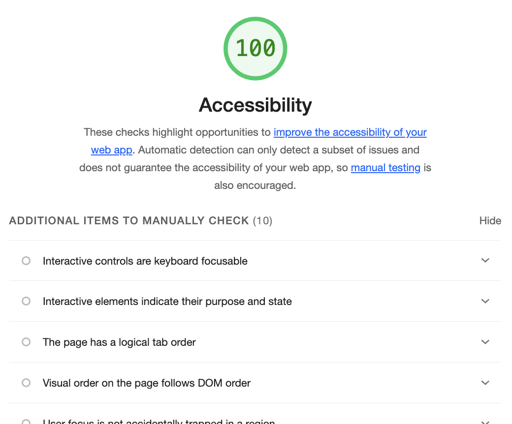

# Digital Accessibility Evaluation
## Ski Resort Website Assessment

  Oleksandr Solovei (No 126784)
  
osolovei@ua.pt

  
    Digital Accessibility and Compliance (ADC) 
    March 19, 2025
  

---
layout: image-right
image: images/0.png
---

# Introduction: Europe Ski Resorts Database

- **Project Overview**: Multilingual web application for finding ski resorts in Europe

- **Key Features**:
  - Resort listings with search and filtering
  - Interactive map with resort locations
  - Articles/guides about skiing
  - Multilingual support

- **Target Audience**: Skiers of all levels, including users with disabilities

---
layout: default
---

# Evaluation Scope

### Pages Evaluated:
- Homepage
- Resorts listing page
- Interactive Map page
- Articles/guides pages
- Navigation header & language selection

### Standards Applied:
- WCAG 2.1 Level AA
- EN 301 549 requirements

### Focus Areas:
- Multilingual accessibility
- Interactive components (map, search, pagination)
- Content readability
- Keyboard and screen reader navigation

---
layout: image-right
image: images/ff.png
---

# Evaluation Methodology

### Manual Testing:
- Keyboard navigation testing
- Screen reader compatibility (VoiceOver)
- Screen magnification (200% zoom)
- Language switching assessment

### Automated Testing:
- Lighthouse accessibility audits
- Firefox Accessibility Inspector
- accessMonitor

---
layout: image-right
image: images/map.png
---
# Keyboard Navigation Results

### Process:
- Navigated through all interactive elements using Tab and Enter keys
- Tested language selector dropdown functionality
- Verified map control accessibility

### Key Findings:
- Map controls lack clear focus indicators
- Language selector dropdown not fully keyboard operable
- Resort table rows missing focus styling

---

# Screen Reader Testing Results

### Tools Used:
- VoiceOver (macOS)

### Major Issues:
- Interactive map not properly announced to screen readers
- Missing alt text for resort images
- Language switcher not properly labeled
- SVG logo missing accessible name

<!--
Demo area: Screenshot of screen reader testing a page
-->

---
layout: image-right
image: images/zoom.png
---
# Screen Magnification Testing

### Tools and Settings:
- Browser zoom (200%)
- OS magnification tools
- Text-only enlargement

### Key Findings:

- Some text with insufficient contrast
- Language Selector button text doesn't fit the button
- Resort table horizontal scrolling issues

---
layout: default
---

# Automated Testing Results: AccessMonitor

### Scores by Page

  

    

      

        
          Homepage: 9.6/10
        
      

    

    

      

    

  

  

    

      

        
          Articles: 9.5/10
        
      

    

    

      

    

  

  

    

      

        
          Article Detail: 8.4/10
        
      

    

    

      

    

  

  

    

      

        
          Map: 8.3/10
        
      

    

    

      

    

  

  

    

      

        
          Resorts: 7.2/10
        
      

    

    

      

    

  

### Key Issues Identified

**Resorts page (Lowest score: 7.2)**
- 6 non-acceptable practices (4 Level A, 2 Level AA)
- Resort table accessibility issues
- Form input labeling problems

**Common issues across pages**
- Missing alternative text for images
- Lack of ARIA landmarks in interactive components
- Language selector accessibility issues
- Missing focus indicators
- SVG accessibility issues

<!--
Scores summary:
- Homepage: 9.6/10 (2 non-acceptable practices)
- Articles: 9.5/10 (2 non-acceptable practices)
- Article Detail: 8.4/10 (5 non-acceptable practices)
- Map: 8.3/10 (4 non-acceptable practices)
- Resorts: 7.2/10 (6 non-acceptable practices)
-->

---
layout: default
---

# Automated Testing: Lighthouse

### Accessibility Scores by Page

  

    

      

        
          Homepage: 99/100
        
      

    

    

      

    

  

  

    

      

        
          Articles: 95/100
        
      

    

    

      

    

  

  

    

      

        
          Article Detail: 95/100
        
      

    

    

      

    

  

  

    

      

        
          Map: 92/100
        
      

    

    

      

    

  

  

    

      

        
          Resorts: 88/100
        
      

    

    

      

    

  

### Common Issues Identified

#### Issue: ARIA roles on incompatible elements
- Found on all pages
- Critical for screen reader compatibility

####  Issue: Contrast ratio problems
- Present on Articles, Article Detail, Resorts, and Map pages
- Affects users with low vision

#### Resorts page
- Missing page `<title>` element
- Form elements without proper labels
- Color contrast issues

#### Map page issues
- Touch targets too small or closely spaced
- Difficult for users with motor impairments

<!--
Page-specific issues:
- Home (99): ARIA roles on incompatible elements
- Articles (95): Contrast ratio, ARIA roles
- Article Detail (95): Contrast ratio, ARIA roles
- Resorts (88): Contrast ratio, ARIA roles, missing title, form labels
- Map (92): Touch targets, contrast ratio, ARIA roles
-->

---
layout: center
class: text-center
---

# Summary of Key Findings

<table class="findings-table">
  <thead>
    <tr>
      <th>POUR Principle</th>
      <th>Issues</th>
      <th>Severity</th>
      <th>Examples</th>
    </tr>
  </thead>
  <tbody>
    <tr>
      <td>Perceivable</td>
      <td>14</td>
      <td>High</td>
      <td>Missing alt text, contrast issues</td>
    </tr>
    <tr>
      <td>Operable</td>
      <td>10</td>
      <td>Medium</td>
      <td>Keyboard focus issues, map controls inaccessible, small touch targets</td>
    </tr>
    <tr>
      <td>Understandable</td>
      <td>8</td>
      <td>Medium</td>
      <td>Language switching issues, missing form labels, inconsistent navigation</td>
    </tr>
    <tr>
      <td>Robust</td>
      <td>7</td>
      <td>High</td>
      <td>ARIA roles on incompatible elements, screen reader compatibility problems</td>
    </tr>
  </tbody>
</table>

---
layout: two-cols
---

# Proposed Changes - High Priority

### Issue: ARIA roles on incompatible elements
- **Solution**: Audit and correct improper ARIA role usage across all pages
- **Impact**: Improved screen reader compatibility and higher Lighthouse scores

### Issue: MapGl component not accessible to screen readers
- **Solution**: Add keyboard controls and ARIA attributes to the map component
- **Impact**: Screen reader users can access and understand map data

::right::

  
  
Example of ARIA role correction

---
layout: two-cols
---

# Proposed Changes - Medium Priority

### Issue: Missing focus indicators throughout site
- **Solution**: Add visible focus styles to all interactive elements
- **Impact**: Keyboard users can navigate more effectively

### Issue: Resort table not fully accessible
- **Solution**: Add proper table headers, implement ARIA attributes
- **Impact**: Screen reader users can understand table data relationships

::right::

  

    
A possible solution for focus indicators

    
  

---
layout: two-cols
---

# Proposed Changes - Low Priority

### Issue: Missing "Skip to content" link
- **Solution**: Add invisible link that appears on focus
- **Impact**: Keyboard users can bypass repetitive navigation

### Issue: Some text with insufficient contrast
- **Solution**: Adjust color palette to ensure 4.5:1 contrast ratio
- **Impact**: Users with low vision can read content more easily

::right::

  

    
  

---
layout: two-cols
---

# Expected Outcomes

### Improved User Experience for:
- Screen reader users navigating multilingual content
- Keyboard-only users accessing interactive features
- Users with low vision browsing resort information
- Users who rely on text alternatives for map data

### Compliance Achievement:
- WCAG 2.1 Levels A and AA
- EN 301 549 compliance

::right::

  

    
  

---
layout: two-cols
---

# Limitations and Future Work

### Current Evaluation Limitations:
- No testing with actual users with disabilities
- Limited testing of dynamically generated content
- No formal testing of all language combinations

### Future Accessibility Improvements:
- Implement full ARIA live regions for dynamic content
- Add audio descriptions for resort images
- Create high-contrast mode theme option
- Develop accessible tutorial for map navigation

::right::

  

    
  

---
layout: center
class: text-center
---

# Conclusion

- The ski resort application requires accessibility improvements in several key areas
- Multilingual content presents unique accessibility challenges
- Interactive components like the map need special attention for accessibility
- Phased approach will systematically improve the experience for all users

---
layout: end
---

# Thank You!
